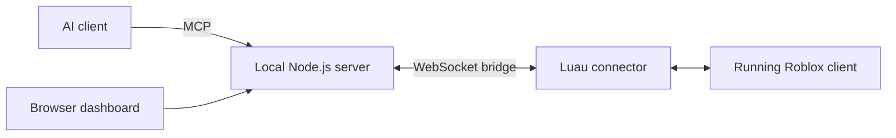

# Roblox Executor MCP Server

[](LICENSE)
[](package.json)
[](src/)

An MCP server that connects an AI client to a live Roblox game. The model calls a tool, the server runs Luau in the game, and hands back structured data. The agent can reverse-engineer scripts, walk the instance tree, spy on remotes, scan memory, hook functions, orchestrate work across many connected clients, and more.

It ships **289 tools** across 22 categories, a dashboard with ten tabs, persistent playbooks and session traces, a token-gated bridge, and a Luau scripting surface (`mcp.*`) that lets one in-game script call any of the server's tools — sequentially, in parallel, batched, or across N clients at once. Schemas are introspectable at runtime via `mcp.help(name?)` so a script never has to guess what arguments a tool takes.

## Start here

This project is the bridge between your AI assistant and a running Roblox executor client. It includes the local Node.js server, browser dashboard, and in-game Luau connector. You supply an MCP-compatible AI client and a compatible executor; executor-specific features depend on the capabilities available in that client. The Cobalt integration is documented for Potassium, with live validation still required.



Use it to explore an instance tree, read properties, inspect scripts and functions, capture remote calls, run Luau, or save a repeatable workflow. The dashboard lets you inspect the same connected clients and run tools directly from your browser.

- [Quick start](#quick-start) — install, configure your AI client, and connect Roblox.
- [Features](#whats-in-the-box) — tools, dashboard, and scripting examples.
- [Configuration](#configuration) — ports, authentication, and execution limits.
- [Troubleshooting](#troubleshooting) — connection and capability checks.
- [Architecture](docs/architecture/overview.md) — how the server is organized.
- [Contributing](CONTRIBUTING.md) — development setup and tool authoring.
- [Third-party notices](THIRD_PARTY_NOTICES.md) — Cobalt attribution and licensing.

## What's in the box

### Tools (289 across 22 categories)

The big ones you'll reach for first:

- **Run code.** `run-luau` executes Luau and returns JSON; `eval-expression` is the one-liner. Everything else is well-tested Luau you didn't have to write.
- **`script` (persistent VM with `mcp.*`).** Write one Luau program that can ALSO call any other tool inline as `mcp.<tool>(args)` and use the result. Globals you define persist across calls (REPL-style); `vm-reset` wipes the VM.
- **`script-fanout`.** Run one script on N connected clients in parallel; per-client `{result, output}` returned with a summary.
- **Reverse engineering.** GC walking, closure constants/upvalues/protos, bytecode disassembly, call graphs, duplicate-function detection, `filtergc`. 34 tools.
- **Remotes.** Inventory, signatures, selectable Cobalt/Ketamine incoming/outgoing capture, persistent filters, pause/resume, reversible block/ignore, active-rule inspection/reset, Ketamine GUI controls, and generated call code. 12 tools.
- **Instrumentation.** Hook-and-log, count calls, spoof returns, trace durations.
- **Closures.** Complete Volt closure primitives: classify/hash/clone/wrap/invoke/hook/restore, retained function handles, stack visibility, environments, constants, upvalues, and protos.
- **Execution-footprint audit.** One bounded read-only Luau report for virtual-input provenance, `getfenv`/global leaks, closure and hook identity, script/source exposure, executor fingerprints, evidence confidence, and truncation telemetry.
- **Actors and Lua states.** Actor discovery/execution, full LuaStateProxy inspection/Execute/Event support, communication channels, parallel-context checks, and bounded actor/channel/state event monitors.
- **Hidden surfaces.** Actor scripts, nil-parented instances, hidden GUIs, `gethui`, detached remotes.
- **Discovery.** `discover-player-values` auto-ranks candidate money/score/XP paths from leaderstats / Player / ReplicatedStorage with a scored heuristic walk.
- **Playbooks.** Save/list/run/delete named, parameterized Luau snippets persisted to `~/.executor-mcp/playbooks/`.
- **Sessions.** Every tool call appends to a JSONL session trace; `session-list/show/replay` browse and re-execute past traces.
- **Discovery aids.** `list-tools` browses the catalog by category. `suggest-tools` ranks matches by past success.
- **Definition intelligence.** Every tool receives a compiled signature, documented fields, defaults/constraints/examples, prerequisites, capability requirements, side effects, verification paths, recovery guidance, and a measurable quality grade. `tool-quality-audit` checks the whole catalog without a game client.
- **AI planning.** `tool-plan` turns a natural-language goal into a schema-aware discover→act→verify workflow with ranked alternatives.
- **Agent context.** `agent-context` bootstraps the current clients, selection, game, executor, and next actions in one read-only call.
- **Agent runtime.** `agent-run` executes explicit workflows with dry runs, mutation approval, `$steps.*` references, retries, and automatic verification; `agent-memory` stores verified facts and successful workflow episodes.
- **World Brain.** `observe-world` fuses the live character, camera, visible GUI, nearby objects, interactables, and tools into bounded semantic handles; `resolve-entity` safely revalidates or rediscovers stale handles.
- **Verified adaptive tasks.** `smart-task` adds plan/preview/execute modes, hard budgets, loop detection, typed recovery branches, and real `assert-state` postconditions. `explain-failure` classifies errors and ranks safe fallbacks without blindly repeating mutations.
- **Rollback and learning.** `state-transaction` restores explicitly captured reversible state, `world-delta` streams bounded event changes, and `teach-mode` turns a user demonstration into a conservative reviewable playbook.

Run `list-tools` once connected for the full catalog, or `GET /api/tools/schema` for JSON schemas, or `GET /mcp.d.luau` for Luau type declarations any editor with a Luau LSP can consume.

See [`docs/architecture/actors-closures.md`](docs/architecture/actors-closures.md) for the capability-first Actor, LuaStateProxy, channel, event-monitor, and closure workflows.
See [`docs/architecture/execution-footprint-audit.md`](docs/architecture/execution-footprint-audit.md) for the target-resolution, evidence, scoring, privacy, and performance contracts of the footprint auditor.
See [`docs/architecture/tool-definition-quality.md`](docs/architecture/tool-definition-quality.md) for the library-wide schema, contract, safety, discovery, recovery, and quality compiler.

### Dashboard

Open `http://127.0.0.1:16384/` once the server's running. Ten tabs, flat-dark, sub-100ms live updates over WebSocket:

- **Clients** — connected games with PlaceId/JobId chips and click-to-explore.
- **Tools** — category-grouped browser of all 289 tools with search.
- **Activity** — live tool-call stream with text/category/outcome filters.
- **Intelligence** — bounded live perceive→resolve→act→verify/recover timeline with targets, confidence, evidence, rollback, and teaching state.
- **Explorer** — Studio-style game tree with real Studio class icons (314 mapped), Properties + Connections panels, paged children with hover prefetch, double-click decompile tabs, a bounded proto/function tree, origin/upvalue metadata, exact line jumps, and cross-script reference navigation.
- **Brief** — Place/Game/JobId metadata, surface counts (RemoteEvent/Script/Tool), Local Player info, top remotes from the spy buffer, Discover Values button, Fanout-across-all-clients starter.
- **Spy** — engine selector for Cobalt/Ketamine, filtered captured remote calls, and capture JSON copying.
- **Playbooks** — list rail + edit pane + parameter form + Run on selected client + Auto-params button that infers `${param}` from string/number literals.
- **REPL** — Luau textarea with `mcp.*` autocomplete from `/api/tools/schema`, Ctrl+Enter to run on the selected client, Save-as-playbook button.
- **Output** — terminal-style print/warn/error stream with per-script scoping, source filter, and a 1.5K-line ring buffer.

### Scripting (`mcp.*`)

Inside a `script` body, `mcp` is bound to the whole tool surface. Tool names map kebab → camelCase:

```lua
local p = mcp.getPlayers()
local r = mcp.searchInstances({ className = "RemoteEvent" })
print(#p .. " players, " .. #r.instances .. " remotes")

-- look up any tool's args at runtime, no guessing — returns
-- { signature, args = {{name, type, optional, nullable, description, constraints, example}, ...},
--   exampleInput, guidance, quality, compiledDescription, ... }
local schema = mcp.help("discover-player-values")

-- batch N independent calls into one round-trip:
local b = mcp.parallel({
  players = function() return mcp.getPlayers() end,
  money   = function() return mcp.discoverPlayerValues({ limit = 5 }) end,
})

-- cross-game pub/sub:
mcp.subscribe("scores", function(payload, fromClientId)
  print("got", payload.score, "from", fromClientId)
end)
mcp.publish("scores", { score = 100 })
```

`mcp.help(name?)` is the in-script equivalent of the top-level `tool-schema` tool: with a name it returns the full per-field detail; with no argument it returns every tool's compact signature. Use it before calling an unfamiliar tool instead of guessing arg shapes.

At the start of a task, call `local context = mcp.agentContext()` to learn the active client, game, executor, and available capabilities. For an ambiguous objective, then use `local plan = mcp.toolPlan({ goal = "find the player's money and verify it" })`. The planner returns ranked tools, exact signatures, mutation/client flags, and one or more discover→act→verify workflows. For multi-step tasks, use the selected tools inside one `script` call and branch on each result rather than assuming a step succeeded.

`mcp.parallel` is a real coroutine scheduler — every `mcp.*` call inside any of the passed functions yields a marker, the scheduler collects markers across all coroutines per round and batches them into ONE `rpc-batch`. A 5-step recipe across 5 coroutines runs in ~5 round trips, not 25.

## How it works

Hexagonal (ports + adapters). The real logic — which client a session targets, how a tool call gets validated and run, what the errors mean — is plain TypeScript that has no idea WebSockets, the MCP SDK, or pino exist. Tests run with fakes; no socket, no SDK, no game.

```
domain/          pure types and rules, no dependencies
application/     ports (interfaces) + use-cases + the Tool contract
infrastructure/  adapters: WebSocket bridge, MCP stdio, pino, dashboard, ...
tools/           the tools themselves, each a defineTool() plugin
interface/       main.ts, the only file that knows about concrete adapters
```

Imports only point inward. `tools` and `infrastructure` lean on `application`, `application` leans on `domain`, and nothing in the core reaches back out.

Adding a tool is one file:

```ts
export default defineTool({
  name: "get-health",
  category: "Inspection",
  input: z.object({ path: z.string() }),
  async execute({ path }, ctx) {
    const hp = await ctx.runLuau(`return ${path}.Humanoid.Health`);
    return { data: { hp } };
  },
});
```

The tool never touches the transport and never picks a client. The invoker resolves the active client first and hands you a `ctx` that's already bound. Longer write-up in [docs/architecture/overview.md](docs/architecture/overview.md); decisions are ADRs under [docs/adr/](docs/adr/).

## Cobalt remote spy (Potassium)

You can also select **Ketamine** with `remote-spy` input `{"operation":"start","engine":"ketamine"}`. The AI can capture both directions, block/unblock outgoing remotes and incoming function callbacks, and switch engines one at a time. `configure-remote-spy` adds persistent capture filters, pause/resume, buffer resizing, and Ketamine GUI visibility/logging; `remote-spy` can inspect/reset active block and ignore rules. Cobalt shares the capture and rule-management improvements and retains RakNet support. See [the dual-spy setup guide](docs/KETAMINE_REMOTE_SPY.md) for requirements, examples, and limitations.

This build keeps Polaris as the MCP server and uses bundled **Cobalt 2.2.5.15** as its remote-spy engine. All capture tools and the dashboard share one Cobalt subscription. Start with `ensure-remote-spy` using `{ "mode": "raknet" }`, or use the dashboard's **Start Cobalt** button. `remote-spy` adds lifecycle/status controls, ranked captures, and call-code generation.

See [COBALT_REMOTE_SPY.md](docs/COBALT_REMOTE_SPY.md) for installation, MCP configuration, examples, and validation limits. The bundled Cobalt build includes a callback/handle cleanup fix for Potassium. Live Potassium testing is still required.

## Windows dashboard shortcut

For the repair ZIP, extract every file directly into your existing project folder and double-click `START-CobaltDashboard.cmd`. It installs locked dependencies and opens the dashboard after the compiled server passes its health check. See [REPAIR-FIRST.md](REPAIR-FIRST.md). MCP clients continue to use `dist/interface/launcher.js`.

## Quick start

Requires **Node.js 20+**, **pnpm 10.27.0**, an MCP-compatible AI client, and a Roblox executor that supports the connector's WebSocket and Luau APIs. This source checkout must be built before it can run.

```bash
git clone https://github.com/okenjioxx/executor-mcp-roblox.git
cd executor-mcp-roblox
pnpm install --frozen-lockfile
pnpm build
pnpm start        # or pnpm dev for watch mode
```

For Windows, after running `pnpm build`, you can double-click `START-CobaltDashboard.cmd` from the project folder to install locked dependencies and open the dashboard.

### Configure your AI client

Add this server to your client's MCP configuration. Replace the example path with the **absolute path** to your checkout; the exact settings location depends on your client.

```json
{
  "mcpServers": {
    "roblox-executor": {
      "command": "node",
      "args": ["C:/Tools/executor-mcp-roblox/dist/interface/launcher.js"]
    }
  }
}
```

Restart or reconnect your MCP client after saving the configuration. On macOS or Linux, use a path such as `/home/you/executor-mcp-roblox/dist/interface/launcher.js`.

The server speaks MCP over stdin/stdout. Point your client (Claude, Cursor, Windsurf, anything that speaks MCP) at `node /path/to/executor-mcp-roblox/dist/interface/launcher.js`. The launcher starts the owner automatically, reuses an already-running owner, and proxies later MCP stdio sessions to it so multiple host windows do not collide on the bridge port. Every proxied connection gets an isolated logical agent session, so its selected Roblox client cannot overwrite another agent's selection. All agents share the same bounded per-client execution scheduler. It also coordinates simultaneous starts with a user-owned lock, removes stale locks, buffers early MCP messages, and can take over after an owner exits. Logs go to stderr; stdout is the protocol channel.

Launcher tuning is optional. `ROBLOX_MCP_LAUNCHER_DEBUG=1` enables startup/proxy diagnostics; `ROBLOX_MCP_RUNTIME_DIR` changes the lock directory; and the `ROBLOX_MCP_LAUNCHER_*` timeout/retry variables can tune slow machines without changing the MCP command.

### Connecting the game

Paste in your executor (or add to autoexec):

```lua
getgenv().BridgeURL = "127.0.0.1:16384"
-- Optional: if the server has ROBLOX_MCP_BRIDGE_TOKEN set, mirror it here.
-- getgenv().BridgeToken = "your-shared-secret"
loadstring(game:HttpGet("http://" .. getgenv().BridgeURL .. "/connector.luau"))()
```

The connector pulls itself from the server, opens a WebSocket to `ws://<BridgeURL>/bridge`, sends a `hello` with its identity + probed capabilities, and from then on runs whatever the server asks and replies with JSON. Wire shapes live in [src/domain/protocol/messages.ts](src/domain/protocol/messages.ts).

### Verify your connection

1. Open `http://127.0.0.1:16384/` and confirm your game appears in **Clients**.
2. Ask your AI client to call `list-clients`, then `select-client` for the client you want to inspect.
3. Call `get-game-info` to confirm the selected game, then `get-instance-tree` to begin exploring.
4. Use `list-tools` and `tool-schema` to discover available tools and their arguments.

## Troubleshooting

| Symptom                                       | What to check                                                                                                                        |
| --------------------------------------------- | ------------------------------------------------------------------------------------------------------------------------------------ |
| AI client cannot start the server             | Run `pnpm build`, confirm `node` is available, and use an absolute path to `dist/interface/launcher.js`.                             |
| Dashboard opens but no game appears           | Run the connector in your executor after joining Roblox; confirm `BridgeURL` matches the server's host and port.                     |
| Connection is rejected after enabling a token | Set the same value in server-side `ROBLOX_MCP_BRIDGE_TOKEN` and connector-side `getgenv().BridgeToken`.                              |
| A tool reports an unsupported capability      | Run `test-capabilities` or `get-executor-info`; support depends on your executor's APIs.                                             |
| An older build is still running               | Stop the old server and reconnect your MCP client; the launcher reuses an existing owner on the same port.                           |
| Cobalt captures are missing                   | Follow the [Cobalt setup guide](docs/COBALT_REMOTE_SPY.md), enable RakNet in Potassium when using RakNet mode, and check spy status. |

Automated tests exercise host logic, bridge behavior, and mocked tool execution. They do not establish compatibility with every executor or replace a live Roblox test. See [validation notes](docs/VALIDATION.md) for the tested scope and known limits.

## Configuration

Read once at startup, validated, then passed read-only. No `process.env` access after that.

| Flag              | Env var                                  | Default           |                                                                                                 |
| ----------------- | ---------------------------------------- | ----------------- | ----------------------------------------------------------------------------------------------- |
| `--port`          | `ROBLOX_MCP_PORT`                        | `16384`           | Bridge + dashboard port.                                                                        |
| `--host`          | `ROBLOX_MCP_HOST`                        | `127.0.0.1`       | Bind address. Keep on loopback unless you've thought about it.                                  |
| `--session-label` | `ROBLOX_MCP_SESSION_LABEL`               | generated         | Friendly name for this process.                                                                 |
| `--no-dashboard`  |                                          | off               | Disable the dashboard entirely.                                                                 |
|                   | `ROBLOX_MCP_BRIDGE_TOKEN`                | unset             | When set, the bridge AND dashboard require this token. Connector reads `getgenv().BridgeToken`. |
|                   | `ROBLOX_MCP_LOG_LEVEL`                   | `info`            | `trace` through `fatal`.                                                                        |
|                   | `ROBLOX_MCP_LOG_PRETTY`                  | off               | `1` for human-readable logs.                                                                    |
|                   | `ROBLOX_MCP_RUNTIME_DIR`                 | `~/.executor-mcp` | Directory for per-port launcher locks.                                                          |
|                   | `ROBLOX_MCP_LAUNCHER_DEBUG`              | off               | `1` to log owner discovery, lock, startup, and proxy transitions.                               |
|                   | `ROBLOX_MCP_LAUNCHER_READY_TIMEOUT_MS`   | `15000`           | Maximum time to wait for a newly spawned owner to expose health + MCP.                          |
|                   | `ROBLOX_MCP_LAUNCHER_MAX_START_ATTEMPTS` | `4`               | Startup retries after a bind/process race.                                                      |
|                   | `ROBLOX_MCP_MAX_CONCURRENT_EVALS`        | `2`               | Active eval lanes per Roblox client; one lane is reserved for nested `mcp.*` work.              |
|                   | `ROBLOX_MCP_MAX_QUEUED_EVALS`            | `128`             | Bounded waiting evals per client; overflow returns retryable `BRIDGE_OVERLOADED`.               |
|                   | `ROBLOX_MCP_MAX_QUEUED_SOURCE_BYTES`     | `4194304`         | Total queued Luau source bytes per client.                                                      |
|                   | `ROBLOX_MCP_RPC_BATCH_CONCURRENCY`       | `8`               | Host workers used inside one in-script RPC batch.                                               |
|                   | `ROBLOX_MCP_MAX_RPC_BATCH_CALLS`         | `128`             | Calls accepted from one RPC batch before later entries receive a bounded error.                 |
|                   | `ROBLOX_MCP_MAX_CONCURRENT_RPC_FRAMES`   | `2`               | Inbound script RPC frames processed per client.                                                 |
|                   | `ROBLOX_MCP_MAX_QUEUED_RPC_FRAMES`       | `32`              | Waiting inbound script RPC frames per client.                                                   |
|                   | `ROBLOX_MCP_SCRIPT_DIRS`                 | —                 | Extra folders `execute-file` may read.                                                          |
|                   | `ROBLOX_MCP_EMBEDDINGS_URL`              | local             | Embeddings endpoint for semantic search (Ollama / OpenAI-compatible).                           |
|                   | `ROBLOX_MCP_EMBEDDINGS_MODEL`            | `embeddinggemma`  | Model name passed to the embeddings endpoint.                                                   |

Other defaults: 30s default per-call timeout, thread identity 8, connector heartbeat every 2s. The default per-script RPC budget is 500 `mcp.*` calls; scripts can opt in to more via the `script` tool's `rpcBudget` input.

The connector independently enforces a second safety layer. Optional executor globals are `MCPMaxConcurrentEvals` (2), `MCPMaxQueuedEvals` (96), `MCPMaxQueuedSourceBytes` (2 MiB), `MCPMaxRpcBatchCalls` (64), `MCPMaxParallelCoroutines` (64), `MCPOutputBufferLimit` (256), `MCPOutputBatchLimit` (50), `MCPOutputMessageLimit` (4096), and `MCPStreamOutput=false` to disable game-log streaming. Overrides are clamped to safe ranges. `bridge-status` and `/api/health` expose active, queued, saturated, and rejected load without touching the game.

### Persistent storage

The server writes to a few places under `~/.executor-mcp/`:

- `playbooks/<name>.json` — saved Luau snippets via `playbook-save` or the dashboard.
- `sessions/<sessionId>.jsonl` — append-only trace of every tool call (one line each); read via `session-show`, replayed via `session-replay`.
- `embeddings.json` — sha256-keyed cache for semantic search; cold-start re-embeds drop from minutes to seconds.

## Safety

Read this once.

- The server runs arbitrary code on your game client. That's the whole point. Only connect AI clients you trust.
- The bridge binds `127.0.0.1` by default. If you switch `--host` to `0.0.0.0`, keep it behind a LAN, VPN, or SSH tunnel — never the open internet.
- For shared multi-user machines, set `ROBLOX_MCP_BRIDGE_TOKEN` to a random string. The bridge then rejects WebSocket handshakes without a matching `getgenv().BridgeToken`, and the dashboard requires the same token via cookie or `X-Executor-MCP-Token` header.
- Tools that mutate game state carry `mutatesState: true` and say so in their description; the risky surface is easy to spot.
- `session-replay` skips originally-failed steps and refuses to replay flagged-mutating tools unless `includeMutating:true` is set explicitly; it also refuses to recursively call itself.
- The per-script RPC budget (default 500) caps how much damage a runaway loop in a `script` can do before the bridge cuts it off.

## Layout

```text
src/
  domain/          pure types and rules
  application/     ports, use-cases, the Tool contract
  infrastructure/  adapters: bridge, MCP stdio, dashboard, semantic, playbooks, sessions, config
  tools/           one folder per category, each tool its own defineTool() file
  interface/       main.ts, the composition root
connector/         the in-game Luau connector
assets/            Studio class-icons sprite sheet
docs/              architecture notes + ADRs
test/              unit + integration + helpers
```

## Scripts

| Command                     |                                                         |
| --------------------------- | ------------------------------------------------------- |
| `pnpm verify`               | Typecheck, lint, and the full test suite.               |
| `pnpm test`                 | Vitest (`test:coverage` / `test:watch` variants exist). |
| `pnpm build`                | Compile to `dist/`.                                     |
| `pnpm dev`                  | Run the server under `tsx watch`.                       |
| `pnpm lint` / `pnpm format` | ESLint and Prettier.                                    |

## Tests

The core is genuinely easy to test, which was the point of laying it out this way. `resolveSelection`, the error mapping, `ToolInvoker`, `SessionManager`, `ScriptBridge`, `FsSavedScriptsStore`, `FsSessionLogger`, `CachedEmbeddingsProvider`, and the preflight all run against fake ports — no socket, no SDK, no game. The bridge has full integration tests under [test/integration/](test/integration/) that drive a real `ws` client through the protocol end-to-end, covering rpc-call, rpc-batch, pub/sub, and auth.

## Contributing

[CONTRIBUTING.md](CONTRIBUTING.md) has the setup, the layer rules, how to add a tool, and the PR checklist.

## License

MIT. See [LICENSE](LICENSE).
